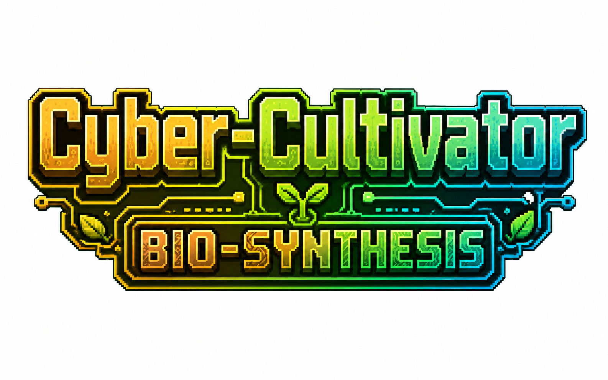

<p align="center">
  
</p>

<p align="center">
  <b>v1.1.3</b> · Forge 1.20.1 · Curios API 5.3.5<br>
  遗传育种算法 + 生物强化血清系统
</p>

<p align="center">
  <a href="#核心循环">玩法</a> ·
  <a href="#设施与机器">设施</a> ·
  <a href="#强化血清">血清</a> ·
  <a href="#curios-饰品">饰品</a> ·
  <a href="#更新日志">更新日志</a> ·
  <a href="README_EN.md">English</a>
</p>

---

## 核心循环

> 挖矿 → 种植 → 培养槽精耕 → 基因育种 → 血清合成 → 强化自身

用精密实验室设备取代传统农业。每颗种子携带独特基因密码，每一次育种都是一场赌博。

---

## 独立资源体系

<table>
<tr>
<td width="50%">

### 矿物

| 矿石 | 掉落 | 用途 |
|------|------|------|
| 硅晶矿 | 硅碎片 | 数据信号、机器合成 |
| 稀土矿 | 稀土粉末 | 精密核心、高级配方 |

</td>
<td width="50%">

### 作物

| 作物 | 收获 | 用途 |
|------|------|------|
| 纤维草 | 植物纤维 | 生命支持箱 |
| 蛋白质豆 | 生化原液 | 血清基础溶剂 |
| 酒精花 | 工业乙醇 | S-03 配方 |

</td>
</tr>
</table>

> 种子获取：纤维草从草丛掉落，蛋白质豆/酒精花从战利品箱获得。

---

## 设施与机器

### 大气冷凝器
自动凝结纯净水，每 30 秒产出 1 瓶，库存上限 32。放置在培养槽正上方自动注入纯净度。支持漏斗。

### 生物培养槽
核心耕作方块。放入基因种子后维持三项数值：

| 数值 | 注入方式 | 作用 |
|------|---------|------|
| 营养度 | 生化原液 | 低于阈值停止生长 |
| 纯净度 | 纯净水 / 冷凝器 | 影响作物品质 |
| 数据信号 | 硅碎片 | 高级作物必需 |

### 基因拼接机
融合两颗种子产出子代。每颗种子三个基因（1-10）：
- **Speed** — 生长速度
- **Yield** — 产量
- **Potency** — 效价（影响血清品质）

**公式：** `新值 = floor((父本 + 母本) / 2) + 随机变异(-2 ~ +2)`

### 血清灌装机
将突触神经莓加工为高级血清。支持漏斗自动化，单片镜 HUD 显示配方/进度/活性。

---

## 强化血清

通过育种提升 Potency → 原料品质 NBT → 莓突触活性 → 血清效果缩放。

```
种子 Potency → 原料品质 → 灌装机合成莓（活性 1-10）→ 血清继承活性 → 饮用效果按活性缩放
```

| 血清 | 效果 | 时长 | 副作用 |
|------|------|------|--------|
| **S-01 突触超频** | 攻速+力量+抗性 III | 25s | 凋零 + 饥饿 |
| **S-02 视觉强化** | 夜视+发光 16-48 格+抗火 III | 30s | 失明 + 饥饿 |
| **S-03 代谢加速** | 回血+移速+跳跃 III | 15s | 缓慢 + 中毒 |

**叠加：** 多次饮用 amplifier+1（上限 VIII），时长累加（上限 5 分钟）。活性 ≥ 8 起步 II 级。

---

## Curios 饰品

| 饰品 | 槽位 | 功能 |
|------|------|------|
| 光谱单片镜 | 头部 | HUD：培养槽/灌装机/冷凝器/拼接机状态 |
| 生化脉冲腰带 | 腰部 | 自动扫描培养槽，消耗背包材料注入数值 |
| 生命支持箱 | 背部 | 加速副作用消退，低血量自动治疗 |

---

## 自动化产线

```
[大气冷凝器] ── 纯净水自动注入 ──→ [生物培养槽] ←── 腰带自动注入
                                          │ 作物成熟
                                          ↓
                                   [血清灌装机] ──→ 高级血清
```

漏斗可连接：冷凝器侧面抽取，灌装机顶部/侧面注入、底部抽取。

---

## 依赖

| 依赖 | 版本 | 必需 |
|------|------|------|
| Minecraft Forge | 1.20.1 (47.4.18) | ✅ |
| Curios API | 5.3.5 | 可选（无则饰品不可用） |
| JEI | 15.0.0+ | 可选（无则配方查看不可用） |

---

## 更新日志

<details>
<summary><b>v1.1.3</b> — 代码审查修复 + 漏斗交互优化 + API 完善</summary>

- 修复第三轮代码审查发现的 12 个问题
- 灌装机漏斗抽取取消加工 + 冷凝器漏斗行为统一 + 输出方向限制
- tryInsertSeed 复制 ItemStack + 清理 dead code 和未使用 import
- 添加 cybercultivator 模组图标

</details>

<details>
<summary><b>v1.1.2</b> — Gene_Synergy 重命名 + Mutation 标签升级 + HUD 透明化</summary>

- Gene_Purity → Gene_Synergy（协同基因），避免与乙醇品质混淆
- Mutation 标签从布尔升级为整数类型码，Tooltip/HUD 显示突变详情
- HUD 背景改为全透明，只保留进度条背景
- 3 个 BlockEntity 同步机制统一修复（空 tag 哨兵 + flags=2）

</details>

<details>
<summary><b>v1.1.1</b> — 血清效果重平衡</summary>

- S-01：攻速+力量随 amplifier 增长，新增抗性 III
- S-02：发光范围 16-48 格随 amplifier 增长，新增抗火 III
- S-03：新增移速+跳跃 III，回血保持 amplifier 缩放
- 副作用差异化：S-01 凋零+饥饿，S-02 失明+饥饿，S-03 缓慢+中毒

</details>

<details>
<summary><b>v1.1.0</b> — 品质链路 + 血清叠加 + HUD 扩展</summary>

- 血清品质链路：原料品质 → 莓活性 → 血清效果缩放
- 血清叠加升级：多次饮用提升等级（最高 V 级）
- 灌装机 4 种配方 + 单片镜 HUD 扩展
- 创造栏品质变体：7 物品 × 10 品质等级

**Bug 修复：** 牛奶 CME 崩溃、血清叠加提前触发副作用、灌装机 HUD 进度条不动、Activity 继承失败、Activity 公式槽位顺序不一致、拼接机 Forge 双次调用、冷凝器 HUD 进度条不动、en_us.json 缺失翻译

</details>

---

## 许可证

MIT License
