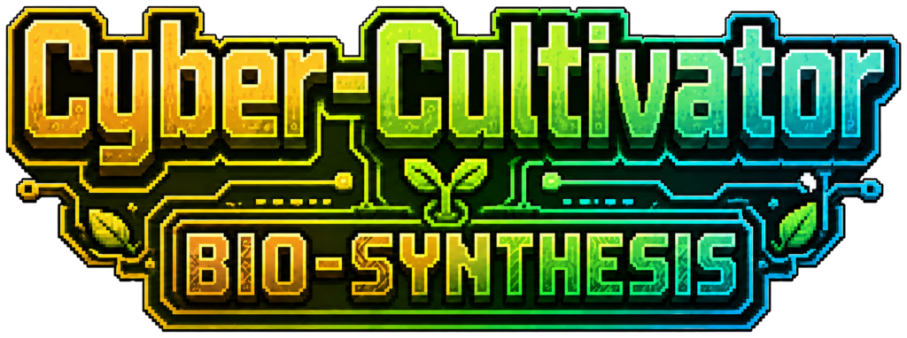

<p align="center">
  
</p>

<h1 align="center">赛博农夫：生物合成</h1>
<h3 align="center">Cyber-Cultivator: Bio-Synthesis</h3>

<p align="center">
  <b>v1.0.0</b> | Minecraft Forge 1.20.1 | Curios API 5.3.5<br>
  遗传育种算法 + 生物强化血清系统
</p>

---

## 模组简介

用精密实验室设备取代传统农业。挖掘矿物、培育基因作物、合成血清，通过基因优化和药剂注射获得超凡能力。每颗种子都携带独特的基因密码，每一次育种都是一场赌博。

**核心循环：** 挖矿 → 种植 → 培养槽精耕 → 基因育种 → 血清合成 → 强化自身

---

## 独立资源体系

### 基础矿物

| 矿石 | 掉落物 | 用途 |
|------|--------|------|
| 硅晶矿 | 硅碎片 | 数据信号注入、机器合成 |
| 稀土矿 | 稀土粉末 | 精密机器核心、高级配方 |

### 基础作物

| 作物 | 收获物 | 用途 |
|------|--------|------|
| 纤维草 | 植物纤维 | 合成生命支持箱 |
| 蛋白质豆 | 生化原液 | 所有血清的基础溶剂 |
| 酒精花 | 工业乙醇 | S-03 血清配方 |

> 种子获取：纤维草种子从破坏草丛获得，蛋白质豆和酒精花种子从地牢/村庄战利品箱获得。

---

## 核心设施

### 大气冷凝器
自动从空气中凝结纯净水，每 10 秒产出 1 瓶。放置在培养槽正上方可自动注入纯净度。支持漏斗抽取。

### 生物培养槽
核心耕作方块。放入基因种子后，需维持三项数值才能生长：

| 数值 | 注入方式 | 作用 |
|------|---------|------|
| 营养度 | 生化原液 | 低于阈值停止生长 |
| 纯净度 | 水桶 / 冷凝器自动 | 影响作物品质 |
| 数据信号 | 硅碎片 | 高级作物必需 |

### 基因拼接机
放入两颗基因种子，自动融合产出新种子。每颗种子携带三个基因属性（1-10）：
- **Gene_Speed** — 生长速度
- **Gene_Yield** — 产量
- **Gene_Potency** — 效价（影响血清品质）

**拼接公式：** `新值 = floor((父本 + 母本) / 2) + 随机变异(-2 ~ +2)`

### 血清灌装机
将突触神经莓加工为高级血清。支持漏斗自动化。

---

## 强化血清

通过基因育种提升 `Gene_Potency`，制造效果更强的血清：

| 血清 | 效果 | 持续时间 | 副作用 |
|------|------|---------|--------|
| **S-01 突触超频** | 攻速+25%、移速+15%、急迫 II | 25 秒 | 神经过载（减速+饥饿） |
| **S-02 视觉强化** | 夜视 + 周围生物发光轮廓 | 30 秒 | 神经过载 |
| **S-03 代谢加速** | 持续回血 + 急迫 | 15 秒 | 神经过载 |

> 药效结束后自动进入「神经过载」状态。佩戴生命支持箱可加速副作用消退。

---

## Curios 饰品

通过探索战利品箱获得（末地城、废弃矿坑、地牢等）：

| 饰品 | 槽位 | 功能 |
|------|------|------|
| 光谱单片镜 | 头部 | 准星对准培养槽时显示 N/P/D 进度条，查看种子基因数值 |
| 生化脉冲腰带 | 腰部 | 自动扫描范围内培养槽，消耗背包材料注入三项数值 |
| 生命支持箱 | 背部 | 加速神经过载消退，低血量时自动注射治疗 |

---

## 自动化产线

```
[大气冷凝器] → 纯净水自动注入
      ↓
[生物培养槽] ← 腰带自动注入营养/信号
      ↓ 作物成熟
[血清灌装机] → 高级血清
```

漏斗可连接在冷凝器侧面抽取纯净水，灌装机顶部/侧面注入材料、底部抽取输出。

---

## 依赖

- **Minecraft Forge** 1.20.1 (47.4.18)
- **Curios API** 5.3.5（饰品系统，可选 — 无 Curios 时饰品功能不可用，其余功能正常）

## 许可证

MIT License
